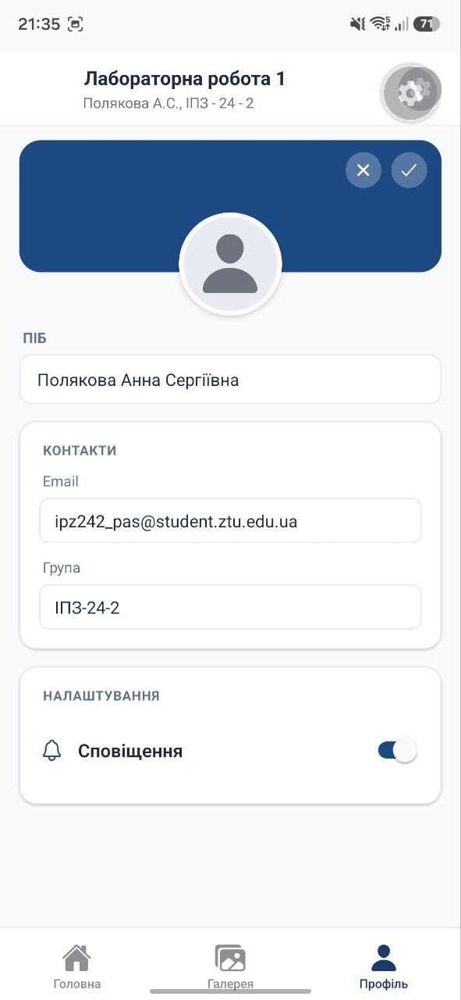

# Лабораторна робота №1: Знайомство з середовищем розробки React Native та Expo

 ІПЗ-24-2 Полякова Анна Сергіївна  


---

## 1. Опис проєкту

Метою роботи є розгортання робочого середовища та розробка кросплатформного мобільного застосунку з використанням фреймворку **React Native**, платформи **Expo** та файлової навігації 

У застосунку реалізовано нижню панель навігації із 3 функціональними екранами
1. **Головна (`index.tsx`)**: фірмова шапка університету із зазначенням даних автора, поле пошуку та стрічка подій університету з датами й анотаціями
2. **Фотогалерея (`gallery.tsx`)** адаптивна сітка зображень у 2 колонки на основі `FlatList`, панель перемикання режиму відображення та інтеграція фотоматеріалів
3. **Профіль (`profile.tsx`)**: персональна картка користувача з банером, аватаром, полями даних (ПІБ, електронна пошта, група) та інтерактивним перемикачем сповіщень (`Switch`).

---

## 2. Інструкція із запуску проєкту

### Покроковий запуск
1. Клонувати репозиторій:
   ```bash
   git clone [https://github.com/Anna-P-C/MobileLabsRN2026.git](https://github.com/Anna-P-C/MobileLabsRN2026.git)
  1. Перейти до каталогу лабораторної роботи:cd MobileLabsRN2026/lab1
  2.Встановити залежності:npm install
  3.Запустити Metro Bundler:npx expo start
  4.Відсканувати отриманий QR-код через застосунок Expo Go на телефоні.
## 3. Результати тестування застосунку

| Головна (верх) | Головна (низ) | Фотогалерея | Профіль |
|:---:|:---:|:---:|:---:|
|  |  |  |  |
## 4. Висновки: Порівняльний аналіз способів запуску та тестування мобільних додатків

| Спосіб запуску | Призначення | Особливості та переваги | Обмеження під час тестування |
|---|---|---|---|
| **Expo Go на фізичному пристрої** | Швидка верстка UI, налагодження бізнес-логіки. | • Миттєвий запуск без компіляції білду.<br>• Fast Refresh (миттєве оновлення при зміні коду).<br>• Реальне відчуття взаємодії з тачскріном та продуктивності. | • Не підтримує сторонні бібліотеки з власним нативним C++/Java кодом.<br>• Вимагає спільної Wi-Fi мережі з ПК. |
| **Емулятори (Android AVD / iOS Simulator)** | Тестування без наявності реального девайса. | • Перевірка відображення на різних роздільних здатностях екранів та версіях ОС.<br>• Повний доступ до системних логів . | • Значно навантажує оперативну пам'ять та процесор ПК.<br>• Мишка не передає ергономіку реальних жестів та свайпів. |
| **Development Build (EAS / Prebuild)** | Фінальне тестування перед релізом у маркети. | • Можливість інтегрувати будь-які нативні модулі.<br>• Повна відповідність релізному APK/AAB файлу. | • Довгий процес збирання проєкту.<br>• Потребує локального Android SDK або хмарних ресурсів EAS. |
| **Веб-версія (Expo Web)** | Швидкий огляд структури в браузері ПК. | • Найшвидший запуск без підключення смартфона чи емулятора[cite: 2].<br>• Доступ до інструментів розробника Chrome DevTools. | • Мобільні API  не працюють або працюють некоректно. |
## Висновок: 
Для етапу проєктування інтерфейсу та базової логіки найзручнішим є Expo Go на фізичному пристрої завдяки швидкості та відсутності тривалої компіляції. Для релізу та нестандартних модулів обов'язковим є створення повноцінних Development/Production збірок.
   
   
